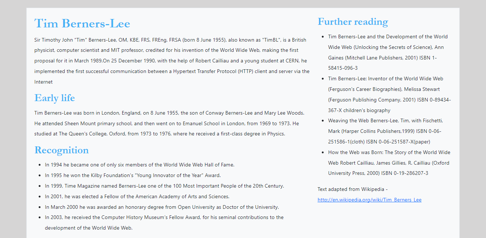

# Introduction to Tailwind
* Download index.html. 
  * Open it in a text editor and in a browser.
  * At the moment it doesn't have any styling.

* Follow the instructions at https://tailwindcss.com/docs/installation to get started with Tailwind. Here are some additional pointers:-
    * If you are at university you will need to use the node.js command prompt. make sure you navigate to your project folder before running the commands.
    * Where it says configure the template paths use a content value of ```["./index.html"]``` in the **tailwind.config.js** file. This is simply telling tailwind where to look for class names. 
    * The file **orig.css** already contains the Tailwind directives.
    * When starting the build process use the following command:-
    ```
    npx tailwindcss -i ./css/orig.css -o ./css/style.css --watch
    ```
    This will generate a file called **style.css**. In the HTML file you should be able to see there is already a link to this file.
* Open **index.html** in a browser you should see that some basic styling has been applied (a background colour and font family)

## Using Tailwind classes
* Style the page simply by using Tailwind classes i.e. don't write any of your own CSS.
* Try and make the page look like the following image
 
* Start by focussing on the following CSS properties. You should be able to find the corresponding Tailwind classes by browsing the Tailwind website (scroll down the left-hand side menu). 
  * Padding 
  * Margins
  * Borders
  * Font weight
  * Line height
  * Colours. You won't be able to match the colours exactly. Choose colours from Tailwind that are as close as you can get. 

## Controlling layout
* Have a look at https://tailwindcss.com/docs/flex-basis and see if you can create a two column layout e.g.


## Making it responsive
* Now can you make the design responsive. The two column layout should only be used on larger sized displays. Have a look at 
https://tailwindcss.com/docs/responsive-design for some advice. 
